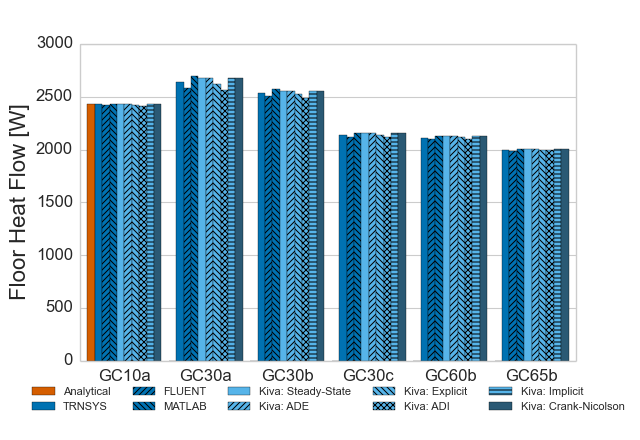

Kiva
====

Kiva is a free and open source ground heat transfer calculation tool written in C++. Specifically, Kiva is used
to calculate heat loss and gain on a timestep basis from building foundations. The goal is
to create a tool that can integrate the multi-dimensional heat transfer into standard building energy simulation engines.

Testing and Validation
----------------------
Kiva has been tested against the International Energy Agency Building Energy Simulation Test (IEA BESTEST) in-depth diagnorstic cases for ground coupled heat transfer related to slab-on-grade construction. The results of which match very closely with the analytical truth standard and the verified numerical truth standards:

Contributing
------------

Kiva is configured as a CMake project. It has been tested on Windows, Mac OS X, and Linux operating systems using GCC (MinGW GCC on Windows).

To build Kiva, you'll need to clone the git repository and use CMake (pointing to the kiva root directory). For the best development experience, I suggest developing on an Ubuntu 64-bit machine.

Pre-requisites:

1. GCC
2. CMake

Kiva has a number of library dependencies which you will need in order to compile the code. The default build uses the Library of Iterative Solvers (LIS), but alternatively one may use UMFPACK for a direct solver (i.e., it is slower, but more accurate).

1. [Boost](http://www.boost.org/) (with compiled binaries) for a variety of functionality
1. [MathGL](http://mathgl.sourceforge.net/) for plotting
 - [libpng](http://www.libpng.org/pub/png/libpng.html)
     - [zlib](http://www.zlib.net/)
1. [yaml-cpp](https://code.google.com/p/yaml-cpp/) for input parsing
1. [Lis](http://www.ssisc.org/lis/) (with `OMPFLAG="-fopenmp"` and `--enable-omp` set)
1. OpenGL for experimetnal shading calculations...this may not exist permanently.
 - GLEW
 - glfw
 - glm

For the UMFPACK (direct solver) alternative, you will need the following instead of Lis.

1. [Boost Numeric Bindings](http://mathema.tician.de/software/boost-numeric-bindings)
1. [SuiteSparse](http://www.cise.ufl.edu/research/sparse/umfpack/) (with openBLAS set in SuiteSparse_config.mk)
 - [OpenBLAS](http://xianyi.github.io/OpenBLAS/)

If you'd like to contribute to this code or if you have questions, send an email to Neal 
Kruis (neal.kruis AT bigladdersoftware DOT com).
