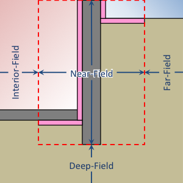
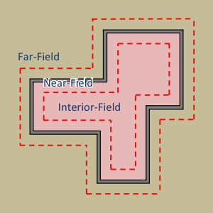
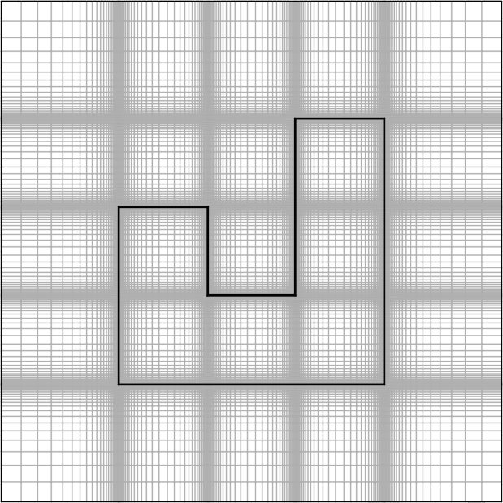

Foundation (Advanced)
=====================

These are additional inputs that can be used to further define the :ref:`foundation` object. These inputs are largely intended for advanced research or testing purposes.

Far-Field Width
---------------

Distance from the interior wall surface to the edge of the domain.

=============   =======
**Required:**   No
**Type:**       Numeric
**Units:**      m
**Default:**    40
=============   =======

Deep-Ground Depth
-----------------

Distance from the grade level to the bottom of the domain.

=============   =======
**Required:**   No
**Type:**       Numeric
**Units:**      m
**Default:**    40
=============   =======

Deep-Ground Boundary Condition
------------------------------

Specifies the type of boundary condition to apply at the deep-ground boundary. Options are:

- ``ZERO-FLUX``, which applies a zero heat flux boundary,
- ``AUTO``, which applies a constant temperature equal to the average outdoor dry-bulb temperature from the weather file, and
- ``CONSTANT-TEMP``, which applies a user-specified constant temperature (see `Deep-Ground Temperature`_).

=============   =============================================
**Required:**   No
**Type:**       Enumeration
**Values:**     ``ZERO-FLUX``, ``AUTO``, or ``CONSTANT-TEMP``
**Default:**    ``ZERO-FLUX``
=============   =============================================

Deep-Ground Temperature
-----------------------

If `Deep-Ground Boundary Condition`_ is ``CONSTANT-TEMP``, then this value specifies the temperature applied to the deep-ground boundary.

=============   =======
**Required:**   Depends
**Type:**       Numeric
**Units:**      K
=============   =======

Convection Calculation Method
-----------------------------

Specifies how convection coefficients are calculated. Options are:

- ``AUTO``, which calculates dynamic convection coefficients based on temperature difference, wind speed, and wind direction.
- ``CONSTANT``, which applies a user-specified convection coefficients to interior and exterior surfaces (see `Interior Convection Coefficient`_ and `Exterior Convection Coefficient`_). This is used primariliy for IEA BESTEST calculations.

=============   ========================
**Required:**   No
**Type:**       Enumeration
**Values:**     ``AUTO`` or ``CONSTANT``
**Default:**    ``AUTO``
=============   ========================

Interior Convection Coefficient
-------------------------------

If `Convection Calculation Method`_ is ``CONSTANT``, then this value specifies the convection coefficient applied to interior surface boundaries (slab floor, interior foundation wall, and interior insulation).

=============   ===============
**Required:**   Depends
**Type:**       Numeric
**Units:**      W/m\ :sup:`2`-K
=============   ===============

Exterior Convection Coefficient
-------------------------------

If `Convection Calculation Method`_ is ``CONSTANT``, then this value specifies the convection coefficient applied to exterior surface boundaries (grade, exterior foundation wall, and exterior insulation).

=============   ===============
**Required:**   Depends
**Type:**       Numeric
**Units:**      W/m\ :sup:`2`-K
=============   ===============

Wall Top Boundary Condition
---------------------------

Specifies how the boundary condition along the wall top is calculated. Options are:

- ``ZERO-FLUX``, which applies a zero heat flux boundary condition along the wall top. This implies that heat flux above the wall top is one dimensional and does not flow through the wall top boundary.
- ``LINEAR-DT``, which applies a linear change in temperature across the wall top (see `Wall Top Temperature Difference`_). This is used only to represent the constraints of the IEA BESTEST analytical solution in case GC10a.

=============   ==============================
**Required:**   No
**Type:**       Enumeration
**Values:**     ``ZERO-FLUX`` or ``LINEAR-DT``
**Default:**    ``ZERO-FLUX``
=============   ==============================

Wall Top Temperature Difference
-------------------------------

If `Wall Top Boundary Condition`_ is ``LINEAR-DT``, then this value specifies the change in temperature across the wall. This is used only to represent the constraints of the IEA BESTEST analytical solution in case GC10a. The actual temperatures are determined based on the values of  `Indoor Air Temperature`_ and `Outdoor Dry-Bulb Temperature`_.

=============   =======
**Required:**   Depends
**Type:**       Numeric
**Units:**      K
=============   =======

Number of Dimensions
--------------------

Switch between two- and three-dimensional simulations. **Warning:** Three-dimensional simulations can be very computationally intensive. Kiva does not impose any limitations, but be warned: some three-dimensional simulations may require more memory than most computers have available.

================  =======
**Required:**     No
**Type:**         Integer
**Constraints:**  2 or 3
**Default:**      2
================  =======

Coordinate System
-----------------

Allows the user to specify the coordinate system used for calculations. For Three-dimensional simulations, this must be ``CARTESIAN``.

=============   ================================
**Required:**   No
**Type:**       Enumeration
**Values:**     ``CARTESIAN`` or ``CYLINDRICAL``
**Default:**    ``CARTESIAN``
=============   ================================

Two-Dimensional Approximation
-----------------------------

These are methods of approximating three-dimensional foundation heat transfer using a two-dimensional coordinate system. Options are:

- ``AP``: Creates an infinite rectangle (`Coordinate System`_ = ``CARTESIAN``) or a circle (`Coordinate System`_ = ``CYLINDRICAL``) with the same *area-to-perimeter* ratio as the three-dimensional `Polygon`_.

- ``RR``: Creates the straight section (`Coordinate System`_ = ``CARTESIAN``) or a rounded cap (`Coordinate System`_ = ``CYLINDRICAL``) of a rounded rectangle with the same area and perimeter as the three-dimensional `Polygon`_.

- ``BOUNDARY``: Creates an infinite rectangle (`Coordinate System`_ = ``CARTESIAN``) or a circle (`Coordinate System`_ = ``CYLINDRICAL``) with an adjusted *area-to-perimeter* ratio from the three-dimensional `Polygon`_. Adjustments are made to represent concave corners of the `Polygon`_.

- ``CUSTOM``: Creates an infinite rectangle (or parallel infinite rectangles) (`Coordinate System`_ = ``CARTESIAN``) or a circle (or concentric circles) (`Coordinate System`_ = ``CYLINDRICAL``) based on the specification of `Length 1`_ and `Length 2`_. This is an experimental  feature where the three-dimensional `Polygon`_ is not used directly to define the approximation.

=============   ===========================================
**Required:**   No
**Type:**       Enumeration
**Values:**     ``AP``, ``RR``, ``BOUNDARY``, or ``CUSTOM``
**Default:**    ``BOUNDARY``
=============   ===========================================

Length 1
--------

Represents the outter width of an infinite rectangle (`Coordinate System`_ = ``CARTESIAN``) or outer radius of a circle (`Coordinate System`_ = ``CYLINDRICAL``).

=============   =======
**Required:**   Depends
**Type:**       Numeric
**Units:**      m
=============   =======

Length 2
--------

Represents the inner width of parallel infinite rectangles (`Coordinate System`_ = ``CARTESIAN``) or inner radius of concentric circles (`Coordinate System`_ = ``CYLINDRICAL``).

=============   =======
**Required:**   Depends
**Type:**       Numeric
**Units:**      m
=============   =======

Use Symmetry
------------

For three-dimensional simulations Kiva can detect planes of symmetry and automatically reduce the simulation domain by half (for a single plane of symmetry), or three quarters (for two planes of symmetry). If this is the case, then direction dependent boundary conditions such as incident solar and wind driven convection are averaged for the symmetric unit.

=============   =======
**Required:**   No
**Type:**       Boolean
**Default:**    True
=============   =======

Mesh
----

The mesh is a compound object that defines the refinement of cells within the calculation domain. Cells are defined within four distinct region types of the domain. The region bounding the foundation wall and insulation elements defines the near-field region. All other regions are defined either laterally (interior and far-field regions) or vertically (deep-field region) relative to the near-field region.

  Illustration of regions (profile view)

  Illustration of regions (plan view)

Cells grow geometrically towards the far-field, deep-ground, and symmetry boundaries. Cells grow towards the center of each interior region and within each structural or insulation component. Example meshes are shown in the following figures.

.. figure:: ../images/mesh-profile.png

  Profile view of a basement mesh

  Plan view of a foundation mesh

**Example:**

.. code-block:: yaml

  Mesh:
    Minimum Cell Dimension: 0.02
    Maximum Near-Field Growth Coefficient: 1.5
    Maximum Deep-Field Growth Coefficient: 1.5
    Maximum Interior-Field Growth Coefficient: 1.5
    Maximum Far-Field Growth Coefficient: 1.5

=============   ===============
**Required:**   No
**Type:**       Compound object
=============   ===============

Minimum Cell Dimension
^^^^^^^^^^^^^^^^^^^^^^

The minimum cell dimension defines the smallest possible dimension of a cell within the domain. This defines the allowable number of cells between element or region boundaries. The cells’ dimensions are allowed to increase to fit within a component or region boundaries according to the growth and distribution of the cells.

=============   =======
**Required:**   No
**Type:**       Numeric
**Units:**      m
**Default:**    0.02
=============   =======

Maximum Near-Field Growth Coefficient
^^^^^^^^^^^^^^^^^^^^^^^^^^^^^^^^^^^^^

The maximum size increase between neighboring cells within the near-field region.

=============   =============
**Required:**   No
**Type:**       Numeric
**Units:**      dimensionless
**Default:**    1.5
=============   =============

Maximum Deep-Field Growth Coefficient
^^^^^^^^^^^^^^^^^^^^^^^^^^^^^^^^^^^^^

The maximum size increase between neighboring cells within the deep-field region.

=============   =============
**Required:**   No
**Type:**       Numeric
**Units:**      dimensionless
**Default:**    1.5
=============   =============

Maximum Interior-Field Growth Coefficient
^^^^^^^^^^^^^^^^^^^^^^^^^^^^^^^^^^^^^^^^^

The maximum size increase between neighboring cells within the interior-field region.

=============   =============
**Required:**   No
**Type:**       Numeric
**Units:**      dimensionless
**Default:**    1.5
=============   =============

Maximum Far-Field Growth Coefficient
^^^^^^^^^^^^^^^^^^^^^^^^^^^^^^^^^^^^

The maximum size increase between neighboring cells within the far-field region.

=============   =============
**Required:**   No
**Type:**       Numeric
**Units:**      dimensionless
**Default:**    1.5
=============   =============

Numerical Scheme
----------------

This defines the numerical scheme used for calculating domain temperatures for successive timesteps. Options are:

- ``IMPLICIT``, a fully implicit scheme with unconditional stability using an iterative solver,
- ``EXPLICIT``, an explicit scheme with conditional stability,
- ``CRANK-NICOLSON``, a partially implicit scheme with unconditional stability using an iterative solver (may exhibit oscillations),
- ``ADI``, a scheme that solves each direction (X, Y, and Z) implicitly for equal sized sub-timesteps. The other two directions are solved explicitly. This allows for an exact solution of the linear system of equations without requiring an iterative solver. This scheme is extremely stable,
- ``ADE``, a scheme that sweeps through the domain in multiple directions using known neighboring cell values. This scheme is very stable,
- ``STEADY-STATE``, domain temperatures are calculated independently of previous timesteps using a steady-state solution from an iterative solver. This is often slower and less accurate than other methods.

=============   =====================================================================================
**Required:**   No
**Type:**       Enumeration
**Values:**     ``IMPLICIT``, ``EXPLICIT``, ``CRANK-NICOLSON``, ``ADI``, ``ADE``, or ``STEADY-STATE``
**Default:**    ``ADI``
=============   =====================================================================================

f-ADI
-----

When `Numerical Scheme`_ is ``ADI``, this defines the weighting between the implicit, and explicit solutions in the sub-timesteps. In general, it is best to make this number very small.

=============   =============
**Required:**   No
**Type:**       Numeric
**Units:**      dimensionless
**Default:**    0.00001
=============   =============

Solver
------

Kiva uses Lis [3]_ (Library of Iterative Solvers) to solve any schema that requires an iterative solution. Refer to their user guide for details on the value options.

=============   ============
**Required:**   No
**Type:**       Enumeration
**Values:**     See [3]_.
**Default:**    ``bicgstab``
=============   ============

Preconditioner
--------------

Preconditioners are used to help solvers find solutions faster. Again the options here come from the Lis documentaiont [3]_.

=============   ===========
**Required:**   No
**Type:**       Enumeration
**Values:**     See [3]_.
**Default:**    ``ilu``
=============   ===========

Maximum Iterations
------------------

Maximum number of iterations allowed in search for a solution.

=============   =======
**Required:**   No
**Type:**       Integer
**Default:**    100000
=============   =======

Tolerance
---------

Tolerance is defined as the relative :math:`\ell^2`-norm of the residual when solving the linear system of equations.

=============   =============
**Required:**   No
**Type:**       Numeric
**Units:**      Dimensionless
**Default:**    1.0e-6
=============   =============

Initialization Method
---------------------

The initialization method determines how the initial temperatures in the domain are set. Options are:

- ``CONSTANT``, spatially-constant initial temperature,
- ``KUSUDA``, a one-dimensional analytical solution developed by that provides temperature variation as a function of depth driven by an annual harmonic temperature fluctuation. There is no temperature variation in horizontal dimensions,
- ``STEADY-STATE``, a steady-state solution scheme initializes the temperatures with the first timestep’s boundary conditions. This provides an initial condition temperature variation in all dimensions.

=============   =============================================
**Required:**   No
**Type:**       Enumeration
**Values:**     ``CONSTANT``, ``KUSUDA``, or ``STEADY-STATE``
**Default:**    ``STEADY-STATE``
=============   =============================================

Initial Temperature
-------------------

When `Initialization Method`_ is ``CONSTANT`` this specifies the temperature to use.

=============   =======
**Required:**   Depends
**Type:**       Numeric
**Units:**      K
=============   =======

Accelerated Initialization Timestep
-----------------------------------

An accelerated initialization begins with the user-defined `Initialization Method`_ and calculates new domain temperatuers prior to the beginning of the simulation using long timesteps (on the order of days, weeks, or months). These timesteps are calculated using a fully implicit, unconditionally stable numerical scheme. This allows the simulation to build a history of temperatures without requiring a signficant amount of additional calculations. The defualt, one week, was found to give very accurate initial temperatures.

=============   =======
**Required:**   No
**Type:**       Integer
**Units:**      days
**Default:**    168
=============   =======

Number of Accelerated Initialization Timesteps
----------------------------------------------

This specifies the number of timesteps (of the size specified by `Accelerated Initialization Timestep`_) to calculate prior to the beginning of the simulation.

=============   =======
**Required:**   No
**Type:**       Integer
**Default:**    12
=============   =======

Number of Warmup Days in Initialization
---------------------------------------

Additional days of initialization can be calculated using the `Timestep`_ and `Numerical Scheme`_ defined by the user. This input specifies the number of days the domain is simulated under these conditions after the accelerated initialization timesteps, but prior to the `Start Date`_ specified in the `Simulation Control`_.

.. [3] The Scalable Software Infrastructure Project. 2014. *Lis User Guide*. The Scalable Software Infrastructure Project, Fukuoka, Japan.
