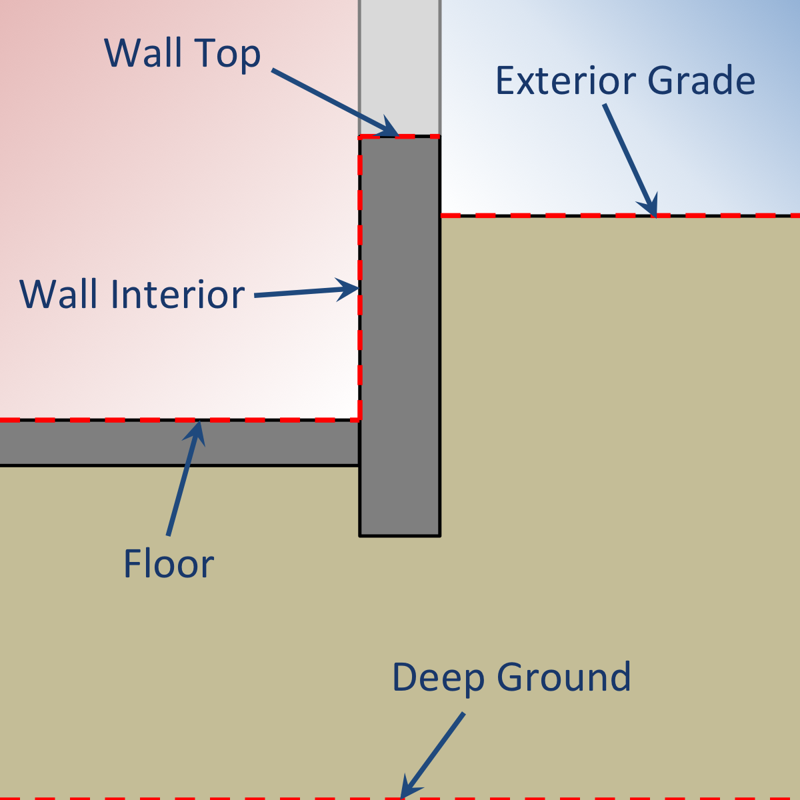

Foundation
==========

The description of the foundation design is provided within the two-dimensional context. This profile is applied along the entire perimeter of the foundation.

   Two-dimensional context for ``Foundation`` object definition

..

Soil
----

Soil Absorptivity
-----------------

Soil Emissivity
---------------

Surface Roughness
-----------------

Vegetation Height
-----------------
