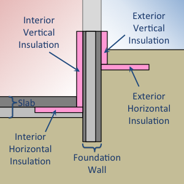
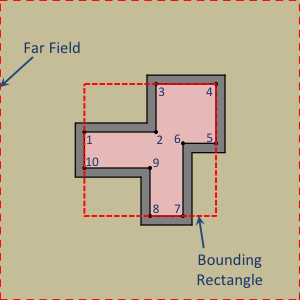

.. _foundation:

Foundation
==========

The description of the foundation design is provided within the two-dimensional context. This profile is applied along the entire perimeter of the foundation.

   Two-dimensional context for ``Foundation`` object definition

The foundation insulation and structural components are defined by (up to) six sub-objects. These objects allow the user to flexibly describe any foundation construction.

   Insulation and structural design components

**Example:**

.. code-block:: yaml

  Foundation:
    Foundation Depth: 0.0 # [m]
    Polygon:
      - [0, 0] # [m, m]
      - [0, 20] # [m, m]
      - [20, 20] # [m, m]
      - [20, 0] # [m, m]
    Soil: Typical Soil # Material reference
    Slab:
      Layers:
        -
          Material: Concrete # Material reference
          Thickness: 0.2032 # [m]
    Wall:
      Layers:
        -
          Material: Concrete # Material reference
          Thickness: 0.3048 # [m]
      Height Above Grade: 0.3048  # [m]
      Depth Below Slab: 0.3 # [m]
    Interior Horizontal Insulation:
      Width: 0.4064 # [m]
      Material: XPS # Material reference
      Thickness: 0.0508
    Interior Vertical Insulation:
      Depth: 0.2032 # [m]
      Material: XPS # Material reference
      Thickness: 0.0508 # [m]

Foundation Depth
----------------

``Foundation Depth`` defines the distance from the wall top to the floor. This value is used to characterize the type of foundation (slab, crawlspace, or basement). For example, a value of zero would represent a sla and a value near 2 meters would represent a basement.

=============   =======
**Required:**   Yes
**Type:**       Numeric
**Units:**      m
=============   =======

.. _polygon:

Polygon
-------

The foundation shape is defined by the description of a single polygon. The perimeter of this polygon defines the location of the interior surface of the foundation wall. The positioning of the foundation insulation and structural components are translated into three-dimensional space internally.

The polygon is specified by a list of x-y Cartesian vertices tracing the foundation perimeter in a clockwise fashion. When simulating in three-dimensions, the polygon must be rectilinear (comprised only of right angles).

   Plan view illustrating foundation shape vertex definition and far-field boundary.

**Example:**

.. code-block:: yaml

    Polygon:
      - [0, 20]
      - [15, 20]
      - [15, 30]
      - [30, 30]
      - [30, 17]
      - [22, 17]
      - [22, 0]
      - [12, 0]
      - [12, 10]
      - [0, 10]

=============   =================================
**Required:**   Yes
**Type:**       List [N] of lists [2] of numerics
**Units:**      m
=============   =================================

Soil
----

Represents the soil surrounding the building foundation.

=============   ==================
**Required:**   Yes
**Type:**       Material reference
=============   ==================

Slab
----

This defines the costruction of the floor slab in the foundation. This is not required. If there is no slab defined for a given foundation, then the floor is exposed soil.

**Example:**

.. code-block:: yaml

  Slab:
    Layers:
      -
        Material: XPS # Material reference
        Thickness: 0.0508 # [m]
      -
        Material: Concrete # Material reference
        Thickness: 0.2032 # [m]

=============   ===============
**Required:**   No
**Type:**       Compound object
=============   ===============

Layers
^^^^^^

Layers are specified as a list of material references, and thickness values from the outtermost layer to the innermost layer (at the floor surface). A layer of insulation can be added to model whole-slab insulation.

=============   ===========================================
**Required:**   Yes
**Type:**       List of layers (a material and a thickness)
=============   ===========================================

Material
""""""""

Material composing the layer.

=============   ==================
**Required:**   Yes
**Type:**       Material reference
=============   ==================

Thickness
"""""""""

Thickness of the layer.

=============   =======
**Required:**   Yes
**Type:**       Numeric
**Units:**      m
=============   =======

Emissivity
^^^^^^^^^^

Interior emissivity of the slab used for interior long-wave radiation calculations.

=============   =============
**Required:**   No
**Type:**       Numeric
**Units:**      dimensionless
**Default:**    0.8
=============   =============

Wall
----

This defines the costruction of the foundation wall. This is not required. If there is no wall defined for a given foundation, then the wall is exposed soil.

**Example:**

.. code-block:: yaml

  Wall:
    Depth Below Slab: 0.3 # [m]
    Height Above Grade: 0.3048  # [m]
    Layers:
      -
        Material: XPS # Material reference
        Thickness: 0.0508 # [m]
      -
        Material: Concrete # Material reference
        Thickness: 0.2032 # [m]
      -
        Material: XPS # Material reference
        Thickness: 0.0508 # [m]

=============   ===============
**Required:**   No
**Type:**       Compound object
=============   ===============

Height Above Grade
^^^^^^^^^^^^^^^^^^

The height of the wall top relative to the grade (z = 0).

=============   =======
**Required:**   No
**Type:**       Numeric
**Units:**      m
**Default:**    0.2
=============   =======

Depth Below Slab
^^^^^^^^^^^^^^^^

The distance from the bottom of the slab to the bottom of the foundation wall. The total wall extends down to this level.

=============   =======
**Required:**   No
**Type:**       Numeric
**Units:**      m
**Default:**    0.3
=============   =======

Layers
^^^^^^

Layers are specified as a list of material references, and thickness values from the outtermost layer to the innermost layer (at the interior wall surface).

Material
""""""""

Material composing the layer.

=============   ==================
**Required:**   Yes
**Type:**       Material reference
=============   ==================

Thickness
"""""""""

Thickness of the layer.

=============   =======
**Required:**   Yes
**Type:**       Numeric
**Units:**      m
=============   =======

Interior Emissivity
^^^^^^^^^^^^^^^^^^^

Interior emissivity of the wall used for interior long-wave radiation calculations.

=============   =============
**Required:**   No
**Type:**       Numeric
**Units:**      dimensionless
**Default:**    0.8
=============   =============

Exterior Emissivity
^^^^^^^^^^^^^^^^^^^

Exterior emissivity of the wall used for exterior long-wave radiation calculations.

=============   =============
**Required:**   No
**Type:**       Numeric
**Units:**      dimensionless
**Default:**    0.8
=============   =============

Exterior Absorptivity
^^^^^^^^^^^^^^^^^^^^^

Exterior absorptivity of the wall used for calculating absorbed solar radiation.

=============   =============
**Required:**   No
**Type:**       Numeric
**Units:**      dimensionless
**Default:**    0.8
=============   =============

Interior Horizontal Insulation
------------------------------

This defines the position, dimensions, and material of interior horizontal insulation. Interior horizontal insulation begins at the wall’s interior surface and extends inward and downward to a user-specified width and thickness at a user-specified depth at or below the `Foundation Depth`_.

**Example:**

.. code-block:: yaml

  Interior Horizontal Insulation:
    Material: XPS # Material reference
    Thickness: 0.0508 # [m]
    Width: 0.4064 # [m]

=============   ===============
**Required:**   No
**Type:**       Compound object
=============   ===============

Material
^^^^^^^^

Insulation material reference.

=============   ==================
**Required:**   Yes
**Type:**       Material reference
=============   ==================

Thickness
^^^^^^^^^

Thickness of the insulation.

=============   =======
**Required:**   Yes
**Type:**       Numeric
**Units:**      m
=============   =======

Depth
^^^^^

Depth of the insulation measured from the bottom of the slab to the top of the insulation.

=============   =======
**Required:**   No
**Type:**       Numeric
**Units:**      m
**Default:**    0.0
=============   =======

Width
^^^^^

Width of the insulation extending from the interior wall surface.

=============   =======
**Required:**   Yes
**Type:**       Numeric
**Units:**      m
=============   =======

Interior Vertical Insulation
----------------------------

This defines the position, dimensions, and material of interior vertical insulation. Interior vertical insulation begins at the wall top and extends downward and inward to a user-specified depth and thickness. The depth can be specified to model partial interior wall insulation.

**Example:**

.. code-block:: yaml

  Interior Vertical Insulation:
    Material: XPS # Material reference
    Thickness: 0.0508 # [m]
    Depth: 0.6096  # [m]

=============   ===============
**Required:**   No
**Type:**       Compound object
=============   ===============

Material
^^^^^^^^

Insulation material reference.

=============   ==================
**Required:**   Yes
**Type:**       Material reference
=============   ==================

Thickness
^^^^^^^^^

Thickness of the insulation.

=============   =======
**Required:**   Yes
**Type:**       Numeric
**Units:**      m
=============   =======

Depth
^^^^^

Depth of the insulation measured from the wall top to the bottom of the insulation.

=============   =======
**Required:**   Yes
**Type:**       Numeric
**Units:**      m
=============   =======

Exterior Horizontal Insulation
------------------------------

This defines the position, dimensions, and material of exterior horizontal insulation. Exterior horizontal insulation begins at the wall’s exterior surface and extends outward and downward to a user-specified width and thickness at a user-specified depth at or below the grade level.

**Example:**

.. code-block:: yaml

  Exterior Horizontal Insulation:
    Material: XPS # Material reference
    Thickness: 0.0508 # [m]
    Width: 0.6096 # [m]

=============   ===============
**Required:**   No
**Type:**       Compound object
=============   ===============

Material
^^^^^^^^

Insulation material reference.

=============   ==================
**Required:**   Yes
**Type:**       Material reference
=============   ==================

Thickness
^^^^^^^^^

Thickness of the insulation.

=============   =======
**Required:**   Yes
**Type:**       Numeric
**Units:**      m
=============   =======

Depth
^^^^^

Depth of the insulation measured from the exterior grade to the top of the insulation.

=============   =======
**Required:**   No
**Type:**       Numeric
**Units:**      m
**Default:**    0.0
=============   =======

Width
^^^^^

Width of the insulation extending from the interior wall surface.

=============   =======
**Required:**   Yes
**Type:**       Numeric
**Units:**      m
=============   =======

Exterior Vertical Insulation
----------------------------

This defines the position, dimensions, and material of exterior vertical insulation. Exterior vertical insulation begins at the wall top and extends downward and outward to a user-specified depth and thickness.

**Example:**

.. code-block:: yaml

  Exterior Vertical Insulation:
    Material: XPS # Material reference
    Thickness: 0.0508 # [m]
    Depth: 2.0  # [m]

=============   ===============
**Required:**   No
**Type:**       Compound object
=============   ===============

Material
^^^^^^^^

Insulation material reference.

=============   ==================
**Required:**   Yes
**Type:**       Material reference
=============   ==================

Thickness
^^^^^^^^^

Thickness of the insulation.

=============   =======
**Required:**   Yes
**Type:**       Numeric
**Units:**      m
=============   =======

Depth
^^^^^

Depth of the insulation measured from the wall top to the bottom of the insulation.

=============   =======
**Required:**   Yes
**Type:**       Numeric
**Units:**      m
=============   =======

Footing
-------

This defines dimensions, and material of the foundation footing. The footing is vertically centered and placed immediately below the foundation wall.

The footing is optional, and has minor impacts on foundation heat transfer while the additional detail increases the required computation time. As an approximation, users may choose to extend the depth of a concrete wall to represent the footing.

**Example:**

.. code-block:: yaml

  Footing:
    Material: Concrete # Material reference
    Depth: 0.254 # [m]
    Width: 0.762 # [m]

=============   ===============
**Required:**   No
**Type:**       Compound object
=============   ===============

Material
^^^^^^^^

Insulation material reference.

=============   ==================
**Required:**   Yes
**Type:**       Material reference
=============   ==================

Depth
^^^^^

Depth (from top to bottom) of the footing (not to be confused with its depth in the ground).

=============   =======
**Required:**   Yes
**Type:**       Numeric
**Units:**      m
=============   =======

Width
^^^^^

Width of the footing.

=============   =======
**Required:**   Yes
**Type:**       Numeric
**Units:**      m
=============   =======

Material Blocks
---------------

Beyond the solid materials explicity defined by the Slab, Wall, and Insulation objects, general Material Blocks may also be used to define any number of variations within the solid domain.

Material Blocks are specified as a list of material references, and geometric inputs. Each block is defined by its position relative to the top interior corner of the foundation wall in the two-dimensional context.

If a Material Blocks overlapping other materials take precendence in the order defined by the list (later blocks have higher precidence).

.. TODO add figure

**Example:**

.. code-block:: yaml

  Material Blocks:
    -
      Material: In-fill Soil # Material reference
      Z Position: 0.3048 # [m]
      X Position: 0.254 # [m]
      Depth: 3.0 # [m]
      Width: 3.0 # [m]
    -
      Material: Batt Insulation # Material reference
      Z Position: 0.0 # [m]
      X Position: 0.0 # [m]
      Depth: 2.44 # [m]
      Width: -0.0889 # [m]

=============   ==============
**Required:**   No
**Type:**       List of blocks
=============   ==============

Material
^^^^^^^^

Material reference.

=============   ==================
**Required:**   Yes
**Type:**       Material reference
=============   ==================

Z Position
^^^^^^^^^^

Starting position of the block relative to the origin at the top of the foundation wall. Defined as positive in the downward direction. Negative values (above the wall) are not allowed.

=============   =======
**Required:**   Yes
**Type:**       Numeric
**Units:**      m
=============   =======

X Position
^^^^^^^^^^

Starting position of the block relative to the interior of the foundation wall. Defined as positive in the outward direction. Negative values indicate a position interior to the wall.

=============   =======
**Required:**   Yes
**Type:**       Numeric
**Units:**      m
=============   =======

Depth
^^^^^

Depth (from top to bottom) of the material block (not to be confused with its depth in the ground [see `Z Position`_]). A positive value extends the block downward (in the positive Z direction) while a negative value extends the block upward.

=============   =======
**Required:**   Yes
**Type:**       Numeric
**Units:**      m
=============   =======

Width
^^^^^

Width of the material block. A positive value extends the block outward (in the positive X direction) while a negative value extends the block inward.

=============   =======
**Required:**   Yes
**Type:**       Numeric
**Units:**      m
=============   =======

Soil Absorptivity
-----------------

Solar absorptivity of the soil or grade surface.

=============   =============
**Required:**   No
**Type:**       Numeric
**Units:**      dimensionless
**Default:**    0.8
=============   =============

Soil Emissivity
---------------

Long-wave emissivity of the soil or grade surface.

=============   =============
**Required:**   No
**Type:**       Numeric
**Units:**      dimensionless
**Default:**    0.8
=============   =============

Surface Roughness
-----------------

Represents the relief of the surface. This value is used to calculate forced convection and the wind speed near the grade surface. Roughness values in the table below are converted from the more qualitative rougness values used in DOE-2 and EnergyPlus. Estimates for soil, gravel, and grass are also shown.

===============  =============
Example Surface  Roughness [m]
===============  =============
Glass                0.00000
Smooth Plaster       0.00044
Clear Pine           0.00052
Concrete             0.00208
Brick                0.00268
Stucco               0.00468
Soil                 0.00500
Gravel               0.01200
Grass                0.03000
===============  =============

=============   =======
**Required:**   No
**Type:**       Numeric
**Units:**      m
**Default:**    0.03
=============   =======

Orientation
-----------

Defines the orientation of the building clockwise relative to North (East = :math:`\pi/2`, South = :math:`\pi`, West = :math:`3\pi/2`). This is used to calculate the solar incidence and wind direction relative to exterior vertical foundation surfaces.

=============   =======
**Required:**   No
**Type:**       Numeric
**Units:**      radians
**Default:**    0.0
=============   =======

Perimeter Surface Width
-----------------------

This value is used to define a portion of the slab's perimeter separately from the slab core. This will affect the meshing of the slab, but is intended primarily for separate output reporting for each region.

=============   =======
**Required:**   No
**Type:**       Numeric
**Units:**      m
**Default:**    0.0
=============   =======
