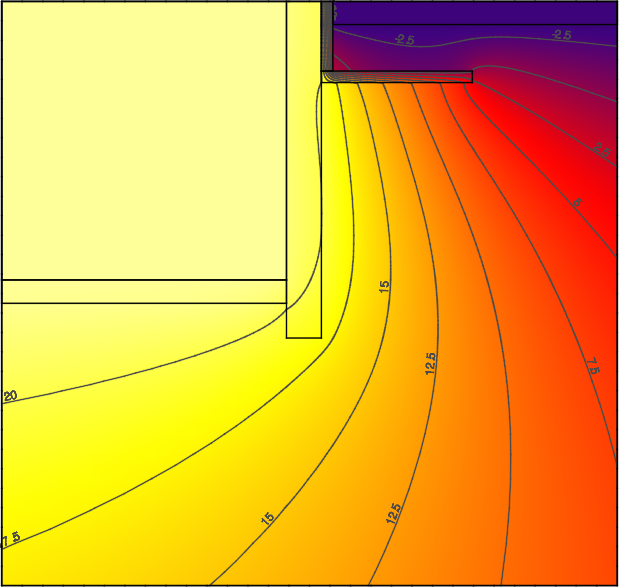
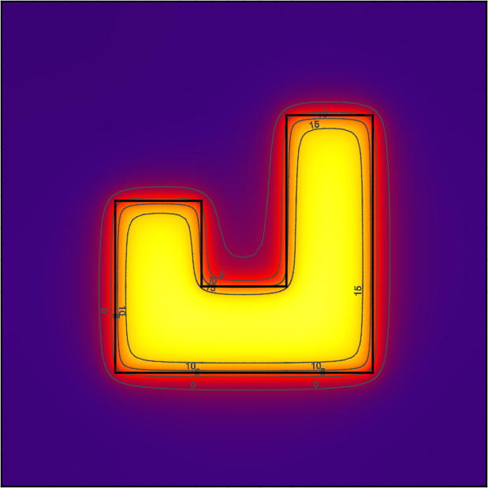

Output
======

Defines what output is provided from Kiva.

**Example:**

.. code-block:: yaml

  Output:
    Output Report:
      Minimum Reporting Frequency: 60 # [min]
      Reports:
        - 0 # Slab Core Average Heat Flux [W/m2]
        - 1 # Slab Core Average Temperature [K]
        - 2 # Slab Core Average Effective Temperature [C]
        - 3 # Slab Core Total Heat Transfer Rate [W]
        - 4 # Slab Perimeter Average Heat Flux [W/m2]
        - 5 # Slab Perimeter Average Temperature [K]
        - 6 # Slab Perimeter Average Effective Temperature [C]
        - 7 # Slab Perimeter Total Heat Transfer Rate [W]
        - 8 # Slab Average Heat Flux [W/m2]
        - 9 # Slab Average Temperature [K]
        - 10 # Slab Total Heat Transfer Rate [W]
        - 11 # Wall Average Heat Flux [W/m2]
        - 12 # Wall Average Temperature [K]
        - 13 # Wall Average Effective Temperature [C]
        - 14 # Wall Total Heat Transfer Rate [W]
        - 15 # Foundation Average Heat Flux [W/m2]
        - 16 # Foundation Average Temperature [K]
        - 17 # Foundation Total Heat Transfer Rate [W]
    Output Snapshots:
      -
       Directory: Output/Profile
       Size: 800
       Frequency: 1
       Start Date: 2015-Dec-21
       End Date: 2015-Dec-21
       X Range: [0, 30]
       Z Range: [-30, 0.3048]

Output Report
-------------

The output report defines what variables are written to the CSV output file and how often they are written.

**Example:**

.. code-block:: yaml

  Output Report:
    Minimum Reporting Frequency: 60 # [min]
    Reports:
      - 0 # Slab Core Average Heat Flux [W/m2]
      - 1 # Slab Core Average Temperature [K]
      - 2 # Slab Core Average Effective Temperature [C]
      - 3 # Slab Core Total Heat Transfer Rate [W]
      - 4 # Slab Perimeter Average Heat Flux [W/m2]
      - 5 # Slab Perimeter Average Temperature [K]
      - 6 # Slab Perimeter Average Effective Temperature [C]
      - 7 # Slab Perimeter Total Heat Transfer Rate [W]
      - 8 # Slab Average Heat Flux [W/m2]
      - 9 # Slab Average Temperature [K]
      - 10 # Slab Total Heat Transfer Rate [W]
      - 11 # Wall Average Heat Flux [W/m2]
      - 12 # Wall Average Temperature [K]
      - 13 # Wall Average Effective Temperature [C]
      - 14 # Wall Total Heat Transfer Rate [W]
      - 15 # Foundation Average Heat Flux [W/m2]
      - 16 # Foundation Average Temperature [K]
      - 17 # Foundation Total Heat Transfer Rate [W]

=============   ===============
**Required:**   No
**Type:**       Compound object
=============   ===============

Minimum Reporting Frequency
^^^^^^^^^^^^^^^^^^^^^^^^^^^

Kiva can provide timeseries output at the same interval as the timestep. This input will override to delay output and write it a a lower frequency. This helps to reduce the output size when running at very small timesteps.

=============   =======
**Required:**   No
**Type:**       Integer
**Units:**      min
**Default:**    60
=============   =======

Reports
^^^^^^^

This is a list of report ID numbers that Kiva will write to the CSV output file. The IDs and there corresponding output are listed in the table below:

====  ===========================================   ===============
ID    Output Variable                               Units
====  ===========================================   ===============
0     Slab Core Average Heat Flux                   W/m\ :sup:`2`
1     Slab Core Average Temperature                 K
2     Slab Core Average Effective Temperature       :math:`^\circ`C
3     Slab Core Total Heat Transfer Rate            W
4     Slab Perimeter Average Heat Flux              W/m\ :sup:`2`
5     Slab Perimeter Average Temperature            K
6     Slab Perimeter Average Effective Temperature  :math:`^\circ`C
7     Slab Perimeter Total Heat Transfer Rate       W
8     Slab Average Heat Flux                        W/m\ :sup:`2`
9     Slab Average Temperature                      K
10    Slab Total Heat Transfer Rate                 W
11    Wall Average Heat Flux                        W/m\ :sup:`2`
12    Wall Average Temperature                      K
13    Wall Average Effective Temperature            :math:`^\circ`C
14    Wall Total Heat Transfer Rate                 W
15    Foundation Average Heat Flux                  W/m\ :sup:`2`
16    Foundation Average Temperature                K
17    Foundation Total Heat Transfer Rate           W
====  ============================================  ===============

When `Perimeter Surface Width`_ is not specified, the entire slab is considered to be "Core".

"Effective Temperature" is used for preprocessed ground temperatures in whole-building simulation engines. These values represent the effective temperature on the ground's side of the slab core, slab perimeter, or wall layers. When used in a whole-building simulation, the construction in the whole-building model should be the same as the layers defined for the respective surface in Kiva (ignoring any insulation objects).

=============   ====================
**Required:**   No
**Type:**       List [N] of integers
**Default:**    No reports
=============   ====================

Output Snapshots
----------------

Output snapshots are used to graphically visualize domain temperatures and/or heat fluxes. Each series of snapshots is part of a list within the `Output Snapshots`_ object. A series consists of potentially many snapshots taken of a slice of the domain at a user-specified frequency between a start and end date.

  Example profile snapshot

  Example plan snapshot

**Example:**

.. code-block:: yaml

  Output Snapshots:
    -
     Directory: Output/Profile
     Size: 800
     Frequency: 1
     Start Date: 2015-Dec-21
     End Date: 2015-Dec-21
     X Range: [0, 30]
     Z Range: [-30, 0.3048]

=============   ============================
**Required:**   No
**Type:**       List [N] of compound objects
=============   ============================

Directory
^^^^^^^^^

Directory where snapshots are created (in same directory as the output CSV file). An ordered file name, ``XXXX.png``, identifies each snapshot within a series. For example, the 134th snapshot in a series with a directory name of ``Profile`` will be created as ``Profile/0134.png``.

=============   ==============
**Required:**   Yes
**Type:**       Directory Path
=============   ==============

Size
^^^^

The size in pixels of each snapshot file. Outputs are all generated as square images.

=============   =======
**Required:**   No
**Type:**       Integer
**Units:**      pixels
**Default:**    800
=============   =======

Frequency
^^^^^^^^^

The frequency, in hours, at which new snapshots are taken. The default is 36 hours so that the snapshots capture both nighttime and daytime output.

=============   =======
**Required:**   No
**Type:**       Integer
**Units:**      hours
**Default:**    36
=============   =======

Start Date
^^^^^^^^^^

Specifies the start date of the snapshots. Snapshots begin at 12:00am of this day. This is specified as a date string (e.g., YYYY-Mon-DD, YYYY/MM/DD).

=============   =====================
**Required:**   No
**Type:**       Date string
**Default:**    Simulation start date
=============   =====================

End Date
^^^^^^^^

Specifies the end date of the snapshots. Snapshots end before 12:00am of the following day. This is specified as a date string (e.g., YYYY-Mon-DD, YYYY/MM/DD).

=============   ===================
**Required:**   No
**Type:**       Date string
**Default:**    Simulation end date
=============   ===================

X Range
^^^^^^^

Defines the range the domain captured in the snapshot in the "X"-direction (``[Xmin, Xmax]``). By default the `X Range`_ will show the entire extents of the "X" direction, and may not show the detail where heat is flowing near the foundaiton. For three-dimensional solutions, a slice along a plane in the "X"-direction can be specified by giving both ``Xmin`` and ``Xmax`` the same value.

The snapshot will round the range to the next cell division.

=============   =========================
**Required:**   No
**Type:**       List [2] of numerics
**Units:**      m
**Default:**    "X" extents of the domain
=============   =========================

Y Range
^^^^^^^

Defines the range the domain captured in the snapshot in the "Y"-direction (``[Ymin, Ymax]``). By default the `Y Range`_ will show the entire extents of the "Y" direction, and may not show the detail where heat is flowing near the foundaiton. For three-dimensional solutions, a slice along a plane in the "Y"-direction can be specified by giving both ``Ymin`` and ``Ymax`` the same value. For two-dimensional simulations this should not be included.

The snapshot will round the range to the next cell division.

=============   =========================
**Required:**   No
**Type:**       List [2] of numerics
**Units:**      m
**Default:**    "Y" extents of the domain
=============   =========================

Z Range
^^^^^^^

Defines the range the domain captured in the snapshot in the "Z"-direction (``[Zmin, Zmax]``). By default the `Z Range`_ will show the entire extents of the "Z" direction, and may not show the detail where heat is flowing near the foundaiton. For three-dimensional solutions, a slice along a plane in the "Z"-direction can be specified by giving both ``Zmin`` and ``Zmax`` the same value.

The snapshot will round the range to the next cell division.

=============   =========================
**Required:**   No
**Type:**       List [2] of numerics
**Units:**      m
**Default:**    "Z" extents of the domain
=============   =========================

Plot Type
^^^^^^^^^

Defines the type of output plotted. Options are ``TEMPERATURE`` and ``HEAT-FLUX``. For ``HEAT-FLUX``, the user may also specify a `Flux Direction`_ for output.

=============   ================================
**Required:**   No
**Type:**       Enumeration
**Values:**     ``TEMPERATURE`` or ``HEAT-FLUX``
**Default:**    ``TEMPERATURE``
=============   ================================

Flux Direction
^^^^^^^^^^^^^^

When `Plot Type`_ is ``HEAT-FLUX``, the snapshots show the magnitude of heat flux throughout the domain. This input allows the user to specify whether they want to display the overall magnitude, ``MAG``, or the magnitude in a given direciton, ``X``, ``Y``, or ``Z``.

=============   =======================
**Required:**   No
**Type:**       Enumeration
**Values:**     ``MAG``, ``X``, ``Y``, or ``Z``
**Default:**    ``MAG``
=============   =======================

Unit System
^^^^^^^^^^^

Defines the units used in the output snapshots. Options are ``IP`` (Inch-Pound), and ``SI`` (International System). Keep in mind that regardless of this value, all other inputs are still defined in the SI unit system.

=============   ================
**Required:**   No
**Type:**       Enumeration
**Values:**     ``IP`` or ``SI``
**Default:**    ``SI``
=============   ================

Output Range
^^^^^^^^^^^^

Specifies the range of output shown in the snapshots. The units of the range depend on the value of `Plot Type`_ and `Unit System`_.

=============   ==================================
**Required:**   No
**Type:**       List [2] of numerics
**Units:**      Depends
**Default:**    [-20, 40]
=============   ==================================

Color Scheme
^^^^^^^^^^^^

Specifies the color scheme used within the `Output Range`_. Options are:

- ``CMR``, best color scheme where colors progress in brightness with magnitude (prints in black-and-white),
- ``JET``, like a rainbow(!), but doesn't print well,
- ``NONE``, do not show any output. This can be used to illustrate meshing independent of results.

=============   =============================
**Required:**   No
**Type:**       Enumeration
**Values:**     ``CMR``, ``JET``, or ``NONE``
**Default:**    ``CMR``
=============   =============================

Mesh
^^^^

Enables the display of the mesh (discretized cells).

=============   =======
**Required:**   No
**Type:**       Boolean
**Default:**    False
=============   =======

Axes
^^^^

Enables the display of the spatial axes, and the colorbar.

=============   =======
**Required:**   No
**Type:**       Boolean
**Default:**    True
=============   =======

Timestamp
^^^^^^^^^

Enables the display of the timestamp.

=============   =======
**Required:**   No
**Type:**       Boolean
**Default:**    True
=============   =======

Gradients
^^^^^^^^^

Enables the display of gradients.

=============   =======
**Required:**   No
**Type:**       Boolean
**Default:**    False
=============   =======

Contours
^^^^^^^^

Enables the display of contours.

=============   =======
**Required:**   No
**Type:**       Boolean
**Default:**    True
=============   =======

Contour Labels
^^^^^^^^^^^^^^

Enables the display of contour labels.

=============   =======
**Required:**   No
**Type:**       Boolean
**Default:**    False
=============   =======

Number of Contours
^^^^^^^^^^^^^^^^^^

Specifies the number of countours to generate between the values specified in `Output Range`_.

=============   =======
**Required:**   No
**Type:**       Integer
**Default:**    13
=============   =======
